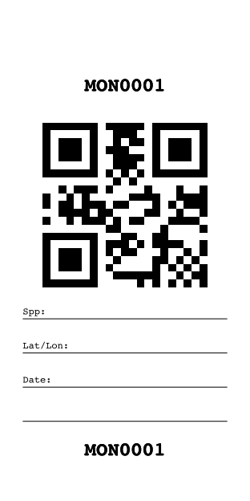

# Fieldwork helper tools

A collection of tools the Borevitz Lab (mainly Kevin Murray) use for fieldwork.

## Install

## Envelope printing -- `mk-field-envelopes`

This python script generates PDFs to print on DL-sized for leaf tissue samples. Can give IDs as a CSV or a numeric range and format string.

